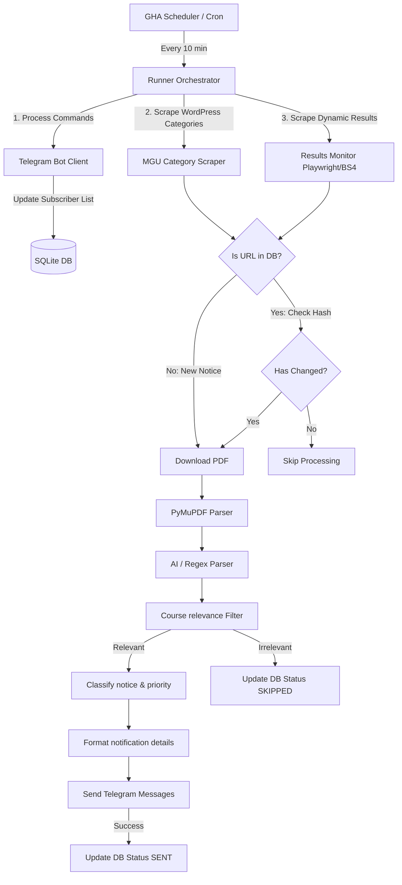

# MGU AI & ML Examination Notifier

A production-ready, highly modular, fault-tolerant Telegram notification system that continuously monitors MG University examination portals and results pages, immediately alerting subscribers of updates related to the **Integrated M.Sc Programme in Computer Science – Artificial Intelligence & Machine Learning**.

---

## 🏗️ System Architecture



### Flow Breakdown
1. **Runner Wake Up**: Triggered by a GitHub Actions cron job (every 10 minutes) or run continuously in daemon mode.
2. **Bot updates polling**: Fetches pending user slash commands (like `/subscribe`) from Telegram and updates the database subscriber list.
3. **Scraping**: Retrieves entries from WordPress categories and Playwright-based results page (Course ID `430`).
4. **Duplicate & Change Detection**: Compares URL and file hashes against SQLite entries.
5. **PDF Analysis**: Downloads new files, parses content using PyMuPDF, and extracts text.
6. **AI Metadata Processing**: Summarizes content and extracts key dates (deadlines, exam dates) using Gemini API (with Regex fallback).
7. **Filters**: Applies course-specific keyword routing and prioritizes emergency updates (cancellations/postponements).
8. **Delivery**: Dispatches structured, HTML-formatted messages to all subscribers.

---

## 🗄️ Database Schema

The system maintains state inside a self-contained SQLite database (`data/mgu_notifier.db`):

### 1. `notifications`
Stores meta details for all scraped announcements.
*   `id` (INTEGER, Primary Key)
*   `title` (TEXT) - Notification title.
*   `url` (TEXT, Unique) - Announcement source link.
*   `published_date` (TEXT) - Normalised announcement date.
*   `category` (TEXT) - classified category (Result, Time Table, Postponement, etc.).
*   `sha256_hash` (TEXT, Unique) - Hash of title + category + URL.
*   `notification_text` (TEXT) - Web content/description text.
*   `pdf_hash` (TEXT) - SHA256 of the attached PDF.
*   `status` (TEXT) - Status code (`SENT`, `SKIPPED`, `UPDATED`).

### 2. `pdfs`
Stores parsed results of downloaded attachments.
*   `id` (INTEGER, Primary Key)
*   `pdf_url` (TEXT, Unique) - Path to PDF.
*   `pdf_hash` (TEXT) - SHA256 file hash.
*   `extracted_text` (TEXT) - Clean raw text from PDF.
*   `summary` (TEXT) - AI/Regex summary.
*   `important_dates` (TEXT) - JSON string containing fee deadlines, exam dates, etc.
*   `metadata` (TEXT) - JSON string containing course/semester metadata.

### 3. `settings`
Stores bot state configuration.
*   `key` (TEXT, Primary Key) - Setting name (e.g. `subscribed_chat_ids`, `last_update_offset`).
*   `value` (TEXT) - Config value.

### 4. `logs`
Stores execution events log history.
*   `id` (INTEGER, Primary Key)
*   `level` (TEXT) - Log level.
*   `module` (TEXT) - Source file name.
*   `message` (TEXT) - Event details.
*   `created_at` (TIMESTAMP) - Logging time.

---

## 🤖 Bot Commands

The bot supports the following commands:
*   `/start` - Welcome prompt, lists commands, and automatically subscribes you to receive alerts.
*   `/help` - Detailed command manual.
*   `/latest` - Lists the 5 most recent relevant updates in database.
*   `/results` - Displays latest result announcements.
*   `/timetable` - Displays theory and practical timetables.
*   `/notifications` - Displays general exam categories.
*   `/highpriority` - Lists emergency notifications (cancellations/postponements).
*   `/search <keyword>` - Queries database notices (e.g. `/search IV Sem`).
*   `/subscribe` - Start receiving automatic push alerts.
*   `/unsubscribe` - Stop receiving automatic push alerts.
*   `/status` - Returns database and bot runtime statistics.

---

## 🚀 Deployment Guide

### Deployment Method A: GitHub Actions (Recommended, Serverless & Free)

Deploying on GitHub Actions does not require a server. The database state is maintained by committing updates back to the repository.

1.  **Fork / Clone the Repository** to your GitHub account.
2.  Go to your Repository **Settings** -> **Secrets and variables** -> **Actions**.
3.  Add the following **Repository Secrets**:
    *   `BOT_TOKEN`: The API token of your Telegram Bot (created via [@BotFather](https://t.me/BotFather)).
    *   `CHAT_ID`: The Telegram Chat/Channel ID where the bot should send default alerts.
    *   `GEMINI_API_KEY`: *(Optional)* Your Google Gemini API Key for AI features.
4.  Enable workflows by going to the **Actions** tab of your repository, selecting the **MGU Exam Monitor** workflow, and clicking **Enable workflow**.
5.  *(Optional)* Trigger the workflow manually by clicking **Run workflow** to verify execution.

---

### Deployment Method B: Docker & Docker Compose (Continuous Daemon)

To host the bot 24/7 on a VPS or local server:

1.  Create a `.env` file from the template:
    ```bash
    cp .env.example .env
    ```
2.  Open `.env` and fill in your variables:
    *   Set `RUN_MODE=daemon` (keeps the polling loop active).
    *   Input your `BOT_TOKEN`, `CHAT_ID`, and `GEMINI_API_KEY`.
3.  Build and launch the containers:
    ```bash
    docker-compose up -d --build
    ```
4.  Monitor execution logs:
    ```bash
    docker-compose logs -f
    ```

---

## 💻 Local Development Setup

To run the notifier locally:

1.  Create a virtual environment:
    ```bash
    python3 -m venv .venv
    source .venv/bin/activate
    ```
2.  Install dependencies:
    ```bash
    pip install --upgrade pip
    pip install -r requirements.txt
    ```
3.  Install Playwright browser:
    ```bash
    playwright install chromium
    ```
4.  Copy and fill in `.env`:
    ```bash
    cp .env.example .env
    ```
5.  Execute unit tests:
    ```bash
    pytest tests/
    ```
6.  Execute a test scraper run:
    ```bash
    python main.py --mode cron
    ```
